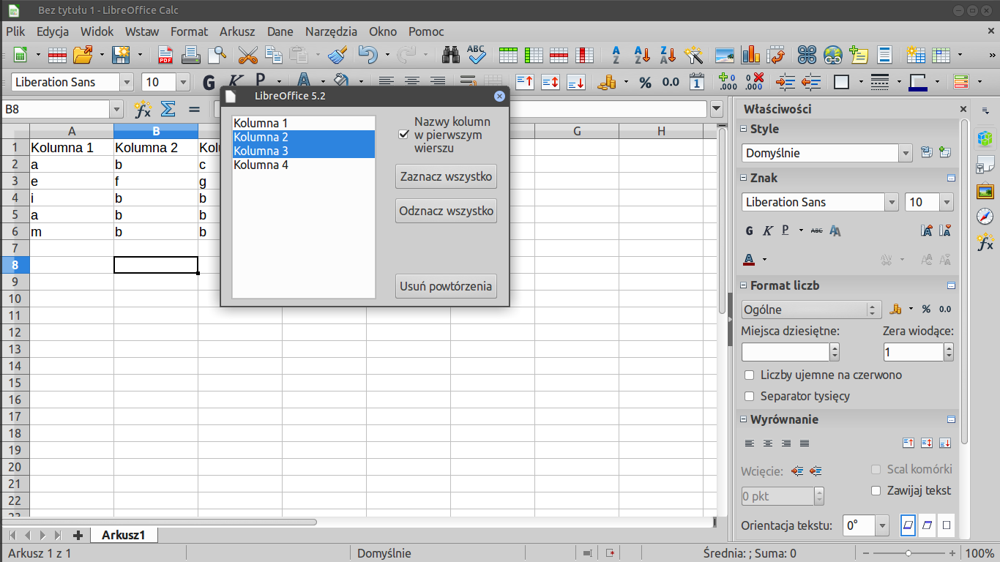

# WojtekTools
tools for LibreOffice created by me:
- RemoveDuplicates
- ComContOfCol

## SCREENSHOTS

## AUTHORS

## NEWS

## INSTALL
1. Go to Tools, Extension Manager....
2. Click Add... and navigate to WojtekTools.oxt.

## CONFIGURE
1. Go to Tools, Customize... and click Add....
2. In Category expand LibreOffice Macros, My Macros, WojtekTools and select function e.g. RemoveDuplicates.
3. In Commands select Execute and click Add.
4. From Toolbar Content, Command select Exceute and click Modify to change name and icon.
